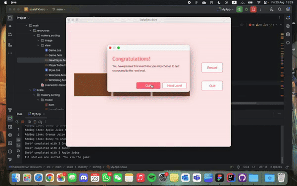

# Goodies Sort
Goodies Sort is an interactive puzzle game that challenges players' strategic thinking and problem-solving skills. The objective of the game is to sort various items into shelves by swapping their positions. Each shelf must be filled with 3 identical items to complete a level.

## Game Features
- Drag and Drop Items
- Restart Game
- Quit Game
- Completion Criteria
- Level Progression
- Player Data Handling

## How to Play
1. **Start the Game**: Launch the game to see the grid with unsorted items.
2. **Drag Items**: Click and drag items to different shelves to sort them into groups of 3 identical items.
3. **Complete a Level**: Once all shelves are correctly filled, a success message will appear, and you can choose to continue or quit.
4. **Restart or Quit**: You can restart the current level or quit at any time (a reminder will appear if quitting means losing progress).

## Program Details
- Scala
- ScalaFX
- FXML
- CSS
- Apache Derby
- H2 Database
- ScalikeJDBC

## Requirements
To run the project locally, make sure your device has installed:
   - Java Development Kit (JDK) 8 or higher.
   - SBT (Scala Build Tool): SBT to manage dependencies and run the project.
   - An IDE that supports Scala, such as [IntelliJ IDEA with the Scala plugin](https://www.jetbrains.com/idea/).

