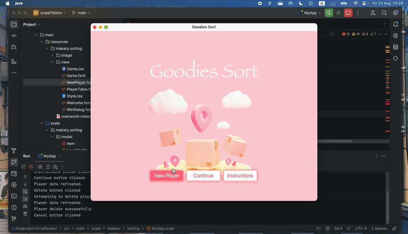

<h1>Overview</h1>
“Goodies Sort” is an engaging and interactive puzzle game designed to challenge players’ strategic thinking and problem-solving skills. The main goal of the game is to sort various items into shelves by swapping their positions, and each shelf in the game needs to be filled with identical items to be considered level completed.

<h1>Main Functionalities</h1>
<li>Drag and Drop Items</li>
<li>Restart Game</li>
<li>Quit Game</li>
<li>Completion Criteria</li>
<li>Level Progression</li>
<li>Player Data Handling</li>

